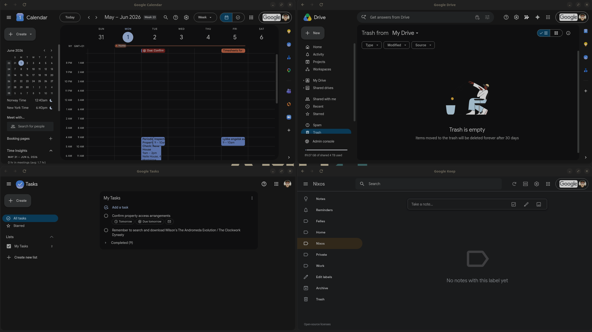
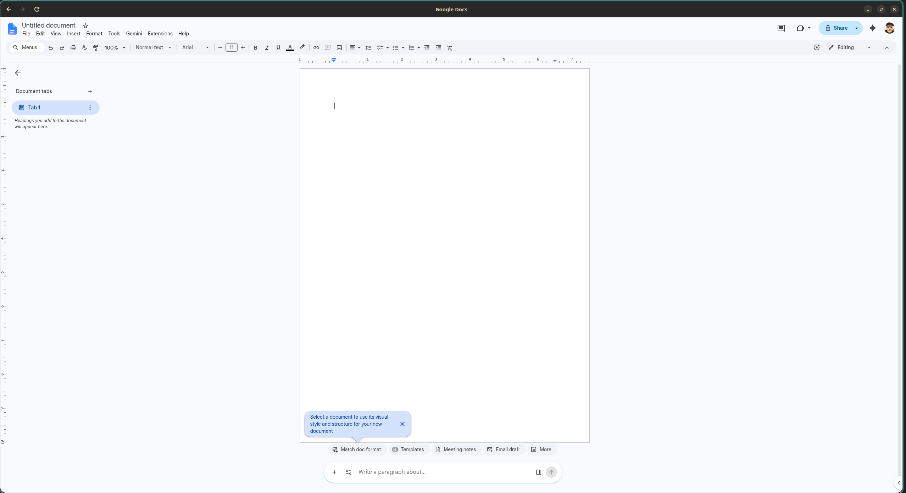
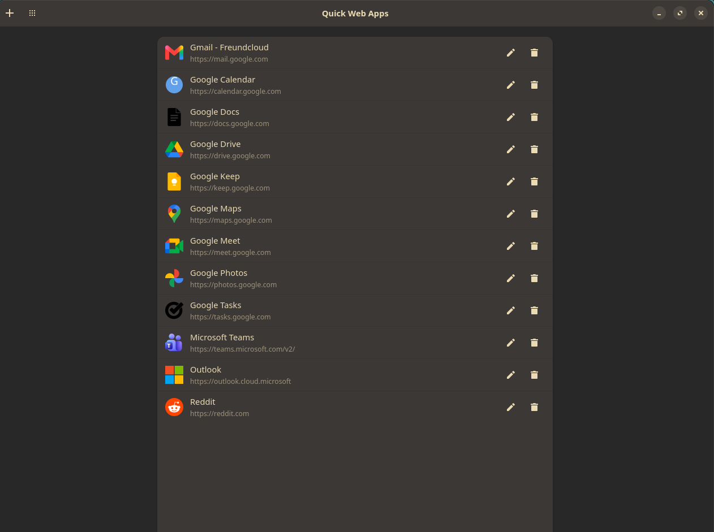
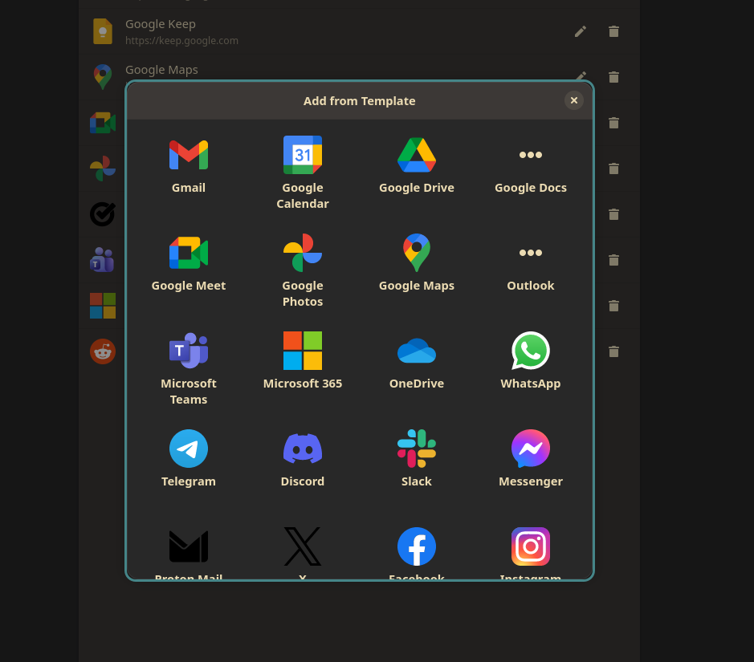
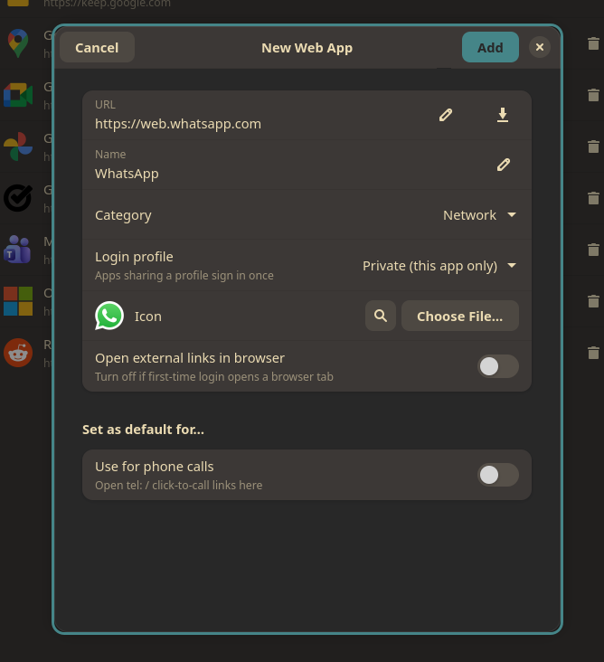
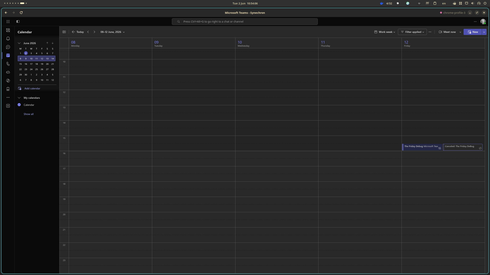
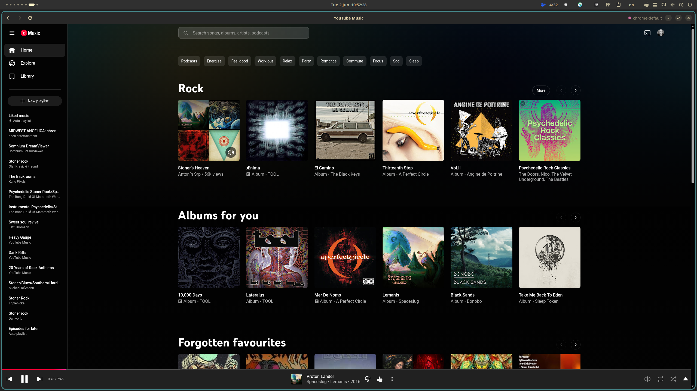
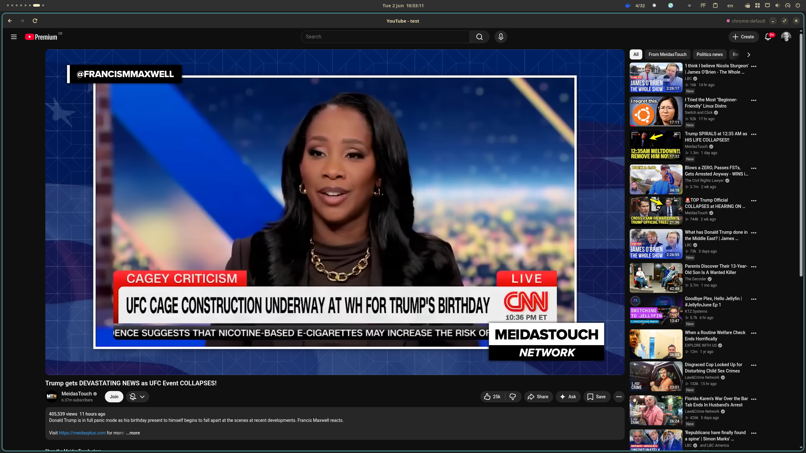

<div align="center">
  <h1>GNOME Quick Web Apps</h1>
  <p><b>Turn any website into a first-class GNOME desktop app.</b></p>
  <p>A GTK4 / libadwaita web-app manager with PWA manifest auto-detection,
     automatic icons, true URL-scope confinement, and bundled Chromium (CEF)
     rendering for broad site and codec compatibility.</p>

  <p>
    <a href="https://olafkfreund.github.io/gnome-quick-web-apps/">Website</a> ·
    <a href="https://github.com/olafkfreund/gnome-quick-web-apps/issues">Issues</a> ·
    <a href="#roadmap">Roadmap</a>
  </p>

  <br>

  <br>
  <em>Your web apps run as real, separate GNOME windows — tile them, Alt-Tab between them, each with its own icon and session.</em>

  <br><br>

  <br>
  <em>Crisp native rendering with a proper window — Google Docs here, indistinguishable from a desktop app.</em>

  <br><br>

  <br>
  <em>Manage all your web apps in one place — each with its own icon, profile and dock identity.</em>

  <br><br>

  <table>
    <tr>
      <td align="center" width="50%">
        <br>
        <em>One-click templates for 50+ popular apps.</em>
      </td>
      <td align="center" width="50%">
        <br>
        <em>Per-app profiles, icons, and dynamic “default for…” toggles.</em>
      </td>
    </tr>
  </table>

  <br>

  <br>
  <em>Microsoft Teams on a shared “Work” profile — note the profile indicator in the title bar. Apps sharing a profile run side by side with one shared login.</em>

  <br><br>

  <table>
    <tr>
      <td align="center" width="50%">
        <br>
        <em>YouTube Music with full audio — a real media app, not a tab.</em>
      </td>
      <td align="center" width="50%">
        <br>
        <em>Video plays out of the box — Chromium (CEF) brings the full codec set.</em>
      </td>
    </tr>
  </table>
</div>

---

> [!NOTE]
> **Built with AI assistance.** This project was developed using
> [Claude Code](https://claude.com/claude-code) (Anthropic) under continuous
> human review and supervision. Every change was reviewed, tested, and approved
> by a human maintainer.

## What is this?

A native GNOME alternative to [`cosmic-utils/web-apps`](https://github.com/cosmic-utils/web-apps)
(Quick Web Apps for the COSMIC desktop). You paste a URL, the app detects the
site's Web App Manifest, fills in the name/icon/theme for you, and installs a
launcher into your GNOME app grid. Each web app runs in its own isolated
window with its own profile and its own dock identity.

### Why it's better than the original

| | Quick Web Apps (COSMIC) | **GNOME Quick Web Apps** |
| --- | --- | --- |
| UI toolkit | libcosmic (iced) | **GTK4 + libadwaita** — native GNOME |
| Setup | type everything manually | **paste a URL → form autofills** from the PWA manifest |
| Icons | pick from Papirus / lettered | **auto-downloaded** best manifest/apple-touch icon, lettered fallback |
| Navigation | open browser window | **scope confinement** — off-scope links open in your system browser |
| Per-app | basic | **profiles, link mode, light/dark, adblock, zoom, custom CSS, UA, permissions, background mode** |
| Identity | one window | **colored profile indicator** + SSO/CAPTCHA-aware link handling |
| Discovery | app grid only | app grid **+ GNOME Shell search provider** (planned) |

Rendering uses **CEF (Chromium Embedded Framework)** for broad site
compatibility (full codec set, Chrome-only sites), the same engine choice as
upstream's v3.

> **DRM streaming (Netflix, Apple Music, Spotify Web) — known issue, work in
> progress.** These need the proprietary Widevine CDM, which can't be bundled.
> Quick Web Apps now reuses the CDM from a host Chromium-family browser (Chrome,
> Chromium, Edge, Brave, Vivaldi) when one is installed, and the CDM loads
> correctly — but some services still report a protected-content error
> (e.g. Netflix `M7701-1003`). We're actively working on fully enabling DRM
> playback; follow [#36](https://github.com/olafkfreund/gnome-quick-web-apps/issues/36)
> for progress. Non-DRM video and the full codec set work today.

## Features

Each web app is a real GNOME window with its own icon, profile and dock
identity — and a set of per-app controls you won't find in a plain "install as
app" button:

- **One-click templates** — 50+ curated apps (Gmail, Teams, Spotify, WhatsApp,
  Notion, Figma, the major AI tools…) added with the right icon in a click.
- **Shared or isolated logins** — group apps onto a named profile to sign in
  once, or keep each app private. Apps sharing a profile **run side by side**
  (one process, one shared session). A **colored profile indicator** in the
  manager and window shows which identity an app uses (e.g. Work vs Private).
- **Spoof the browser OS** — an "Identify as" option (Windows / macOS / Mobile /
  custom user agent) for services that gate features by operating system.
- **Smart link handling** — a tri-state per app: keep everything in-window, or
  send other sites to your browser by registrable domain or by exact host. A
  built-in **identity/SSO/CAPTCHA allowlist** keeps multi-domain sign-in
  (Microsoft, Google, Okta, Cloudflare) working in-window, and we never eject a
  POST navigation (no broken `AADSTS900561`-style logins).
- **Default handlers** — make a web app your system default for email, calendar
  or calls, including deep links with no Linux app (Teams `msteams:`, Zoom). It
  degrades gracefully on declaratively-managed (NixOS/home-manager) systems.
- **Sticky GNOME notifications** — desktop notifications carry the app's name +
  icon and stay in the notification list, and **background-app mode** keeps an
  app running (hidden) so notifications keep arriving after you close the window.
- **Built-in ad/tracker blocker** — an optional per-app network blocklist.
- **Appearance & comfort** — force **light/dark** per app (independent of the
  system theme), inject **custom CSS**, set a per-app user agent / mobile mode,
  and **page zoom** (Ctrl+scroll / Ctrl+±/0) that — along with window size — is
  **remembered between sessions**.
- **Permission policy** — notifications/clipboard are granted; camera/mic and
  location are denied unless you opt in per app.
- **Crisp on HiDPI** — renders at the display's true (fractional) scale, so it
  stays sharp on scaled and fractional-scaling (e.g. Niri) setups.
- **Downloads** — saved to your Downloads folder.
- **Automatic icons** — best manifest/apple-touch icon, an online icon search,
  your own file, or a generated lettered fallback.

## Architecture

```
crates/core      shared model, JSON storage, PWA manifest detection,
                 icon pipeline, DynamicLauncher (.desktop) install
crates/manager   GTK4/libadwaita editor — create/edit/delete web apps
crates/runner    CEF binary launched by each .desktop (per-app window)
docs/            GitHub Pages showcase site
```

Two upstream techniques are reused (and are why this project is GPL-3.0):
the **XDG DynamicLauncher portal** for sandbox-safe `.desktop` install, and
`StartupWMClass` per app so each window gets its own dock/Alt-Tab identity.

## Roadmap

- [x] **Phase 1 — Core + Manager (parity):** data model, storage, launcher install, GTK4 manager listing/CRUD.
- [x] **Phase 2 — Differentiators:** PWA manifest autofill, auto-icon download, scope confinement, per-app UA, adblock, default handlers, profiles.
- [x] **Phase 3 — Native shell:** CEF off-screen rendering inside a libadwaita window with a real header bar, per-app zoom/CSS, light/dark, HiDPI.
- [x] **Phase 4 — Polish:** background mode, downloads, permission policy, profile indicator, prebuilt release bundles (Nix + Flatpak).
- [ ] **Later:** GNOME Shell search provider, import from COSMIC / Linux Mint webapp-manager.

The initial roadmap is complete (releases up to **v0.1.4**). New work is tracked
as standalone [issues](https://github.com/olafkfreund/gnome-quick-web-apps/issues).

## Installation

### NixOS / Nix (flake)

```sh
# Try it without installing
nix run github:olafkfreund/gnome-quick-web-apps

# Install into your profile
nix profile install github:olafkfreund/gnome-quick-web-apps
```

In a NixOS or Home Manager config:

```nix
{
  inputs.quick-web-apps.url = "github:olafkfreund/gnome-quick-web-apps";

  # then, in your packages:
  environment.systemPackages = [ inputs.quick-web-apps.packages.${pkgs.system}.default ];
  # or home.packages = [ ... ];
}
```

The flake pins the matching CEF build and patches it for NixOS, so no manual
setup is needed.

### Declarative web apps (the Nix way)

Beyond installing the package, the flake ships a **Home Manager module** so you
can define your web apps declaratively — in your config, reproducible across
machines — instead of (or alongside) the GUI manager. Each declared app is
written as the same `apps/<id>.json` the runner reads, plus a matching
`.desktop` launcher, with no activation scripts or portal calls.

```nix
{
  inputs.quick-web-apps.url = "github:olafkfreund/gnome-quick-web-apps";

  # Import the module in your Home Manager configuration:
  imports = [ inputs.quick-web-apps.homeManagerModules.default ];

  programs.quick-web-apps = {
    enable = true;                       # also installs the package

    apps.youtube-music = {
      name = "YouTube Music";
      url = "https://music.youtube.com";
      category = "Audio";
      showBadge = false;
    };

    apps.teams = {
      name = "Microsoft Teams";
      url = "https://teams.microsoft.com";
      category = "Network";
      runInBackground = true;            # keep alive for notifications
      autostart = true;                  # start on login
      icon = ./icons/teams.png;          # optional; falls back to the app icon
    };

    apps.gmail = {
      name = "Gmail";
      url = "https://mail.google.com";
      category = "Network";
      profile = "google";                # share a login with other Google apps
      linkScope = "exact_host";          # open off-site links in the browser
      showBadge = true;
    };
  };
}
```

The attribute key (`youtube-music`, `teams`, …) is the stable app id — use a
simple `[a-z0-9-]` slug. Every editor option is exposed (`profile`, `adblock`,
`colorScheme`, `customCss`, `userAgent`, `mobile`, `allowCameraMic`,
`allowLocation`, `handlers`, window `width`/`height`, …); anything not yet
surfaced can be set verbatim via `extraConfig`. You can mix declarative apps and
GUI-created ones freely — they live side by side.

> **DRM on NixOS (known issue, in progress):** the runner reuses the Widevine
> module from a host Chromium-family browser (e.g. `pkgs.chromium` or
> `pkgs.google-chrome`) — no sandbox, so no extra permissions needed. The CDM
> loads, but full DRM playback for some services (Netflix, Apple Music) is still
> being worked on — see [#36](https://github.com/olafkfreund/gnome-quick-web-apps/issues/36).

### Everyone else — Flatpak

The easiest path is the prebuilt bundle: grab `gnome-quick-web-apps-x86_64.flatpak`
from the [latest release](https://github.com/olafkfreund/gnome-quick-web-apps/releases)
and `flatpak install --user gnome-quick-web-apps-x86_64.flatpak`.

To build it yourself, let `flatpak-builder` pull every dependency (the GNOME 50
runtime/SDK and the `rust-stable` SDK extension) from Flathub automatically —
no manual `flatpak install` step:

```sh
flatpak remote-add --user --if-not-exists flathub \
  https://flathub.org/repo/flathub.flatpakrepo
flatpak-builder --user --install --force-clean --install-deps-from=flathub \
  build build-aux/flatpak/io.github.olafkfreund.QuickWebApps.yml
```

The `--install-deps-from=flathub` flag is what installs the runtime/SDK for you.
The `rust-stable` extension version is **not** pinned in the manifest — flatpak
resolves it to the branch matching the GNOME 50 SDK, so it never goes stale (an
earlier README hint pinned `//25.08`, which you should ignore). The offline
cargo sources (`cargo-sources.json`) are committed, and CI builds an installable
`.flatpak` bundle on every push.

## Building from source (dev)

> Requires the Rust toolchain, GTK4 ≥ 4.12 and libadwaita ≥ 1.5. On NixOS use
> the dev shell (it provides the CEF runtime libraries):

```sh
nix develop -c just build      # manager + runner + helper
nix develop -c just run <id>   # launch a web app's CEF window
nix develop -c just manager    # the editor
```

## License

[GPL-3.0-only](LICENSE). Portions of the launcher logic are derived from
`cosmic-utils/web-apps` (GPL-3.0).
